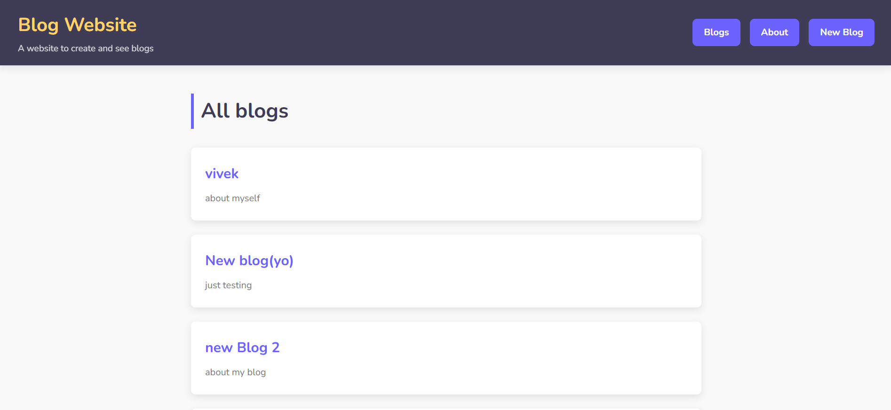
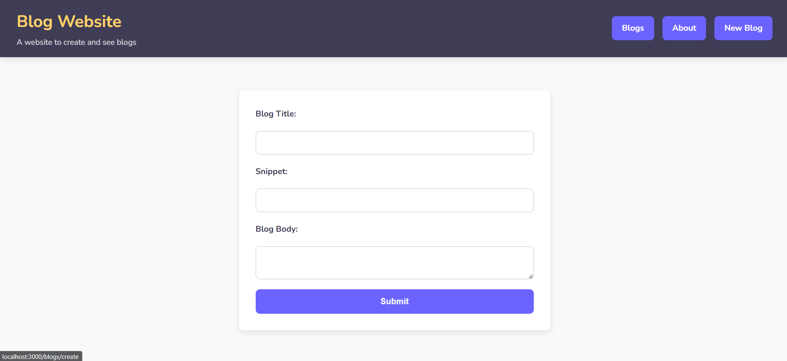

# Blog Website

A full-stack blog application built with **Node.js**, **Express.js**, **MongoDB**, and **EJS** templating engine. This blog platform provides complete **CRUD** (Create, Read, Update, Delete) functionality for managing blog posts, with a **clean, responsive design**.

## 🌟 Features

* **Create**: Write and publish new blog posts with title, content, and automatic timestamps.
* **Read**: Browse all blog posts on the homepage and view individual posts in detail.
* **Update**: Edit existing blog posts with pre-filled forms.
* **Delete**: Remove blog posts with confirmation.
* **Responsive Design**: Mobile-friendly interface that works across all devices.
* **Navigation**: Clean navigation between pages.
* **404 Error Handling**: Custom not-found page for better user experience.
* **About Page**: Static page for blog information.

## 🚀 Live Demo

Check out the repository: [GitHub Repository](https://github.com/Vivek-1499/Blog-Website)

## 🛠️ Tech Stack

* **Backend**: Node.js, Express.js
* **Database**: MongoDB with Mongoose ODM
* **Templating**: EJS (Embedded JavaScript)
* **Styling**: CSS3 with responsive design
* **Environment Config**: dotenv

---

## ⚙️ Getting Started

### Prerequisites

* Node.js (v14 or higher)
* MongoDB Atlas account or local MongoDB installation
* Git

### Installation Steps

1. **Clone the repository**

   ```bash
   git clone https://github.com/Vivek-1499/Blog-Website.git
   cd Blog-Website
   ```

2. **Install dependencies**

   ```bash
   npm install
   ```

3. **Set up environment variables**

   Create a `.env` file in the root directory:

   ```env
   DB_URI=your_mongodb_connection_string_here
   ```

4. **Configure MongoDB Atlas**

   * [MongoDB Atlas](https://www.mongodb.com/atlas)
   * Create a cluster, user, and get your connection string.
   * Update `.env` with your credentials.

   Example:

   ```
   mongodb+srv://<username>:<password>@cluster0.xxxxx.mongodb.net/blogdb?retryWrites=true&w=majority
   ```

---

## 🏃 Running the Application

For **development** (with auto-restart on file changes), run:

```bash
nodemon ejs
```

For **production**:

```bash
npm start
```

The application will run on:

```
http://localhost:3000
```

---

## 📂 Project Structure

```
Blog-Website/
├── public/                 # Static assets
│   ├── styles.css          # Main stylesheet with responsive design
│   └── images/             # Blog images and assets
├── files/                  # EJS template files
│   ├── partials/           # Reusable template components
│   │   ├── header.ejs
│   │   ├── footer.ejs
│   │   └── nav.ejs
│   ├── index.ejs           # Homepage - displays all blogs
│   ├── create.ejs          # Create new blog post form
│   ├── details.ejs         # Individual blog post display
│   ├── about.ejs           # About page content
│   └── notfound.ejs        # Custom 404 error page
├── routes/
│   └── blogRoutes.js       # Express routes for blog operations
├── models/
│   └── blog.js             # Mongoose schema for blog posts
├── controllers/
│   └── blogController.js   # Business logic for route handlers
├── .env                    # Environment variables
├── .gitignore
├── ejs.js                  # Main server file
├── package.json
└── README.md
```

---

## 📡 API Routes

| Method | Endpoint        | Description               |
| ------ | --------------- | ------------------------- |
| GET    | `/`             | Homepage with all blogs   |
| GET    | `/about`        | About page                |
| GET    | `/blogs/create` | Create blog post form     |
| POST   | `/blogs`        | Submit new blog post      |
| GET    | `/blogs/:id`    | View individual blog post |
| DELETE | `/blogs/:id`    | Delete blog post          |

---

## 🖼️ Screenshots

### Homepage


*Browse all blog posts with titles, snippets, and publication dates.*

### Blog Detail Page


*Read full blog posts with complete content and metadata.*

### Create Post Page


*Write and publish new blog posts with a clean editor interface.*

---

## 🤝 Contributing

1. Fork the repository.
2. Create a feature branch:

   ```bash
   git checkout -b feature/your-feature
   ```
3. Commit your changes:

   ```bash
   git commit -am 'Add your feature'
   ```
4. Push to your branch:

   ```bash
   git push origin feature/your-feature
   ```
5. Create a Pull Request.

---

## 💬 Support

If you encounter any issues or have questions, please open an issue in the repository or contact me.

---
