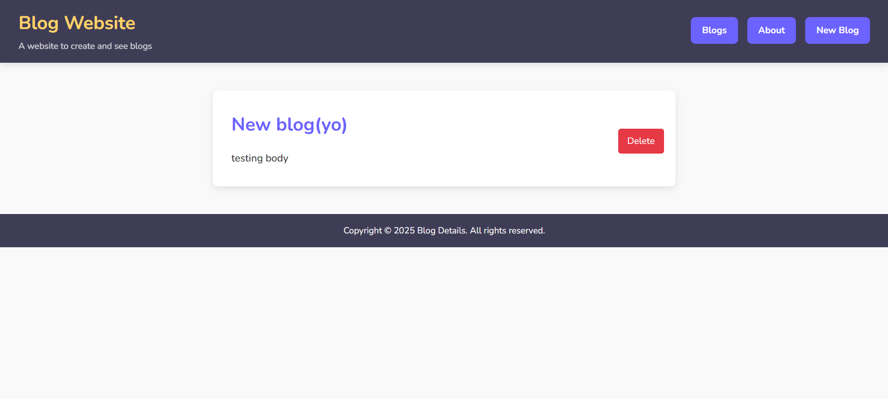

Your **Blog Website** documentation is already well-structured, but I’ll help you refine and polish it to make it more professional, concise, and free from redundancy. Here's the **final version** of your README.md:

---

# Blog Website

A full-stack blog application built with **Node.js**, **Express**, **MongoDB**, and **EJS** templating engine. This platform offers complete **CRUD (Create, Read, Update, Delete)** functionality for managing blog posts, with a clean and responsive design.

---

## 🌟 Features

* **Create**: Write and publish blog posts with a title, content, and automatic timestamps.
* **Read**: View all blog posts on the homepage or individual post details.
* **Update**: Edit existing blog posts via pre-filled forms.
* **Delete**: Remove blog posts with confirmation.
* **Responsive Design**: Works seamlessly across all devices.
* **Navigation**: Clean page transitions for better UX.
* **404 Error Handling**: Custom "Not Found" page.
* **About Page**: Static page for blog/project information.

---

## 🚀 Getting Started

### Prerequisites

* **Node.js** (v14+)
* **MongoDB Atlas** account or local MongoDB installation
* **Git**

### Installation

1. **Clone the repository**:

   ```bash
   git clone <your-repository-url>
   cd Blog-Website
   ```

2. **Install dependencies**:

   ```bash
   npm install
   ```

3. **Configure environment variables**:

   Create a `.env` file in the project root:

   ```env
   DB_URI=your_mongodb_connection_string
   PORT=3000
   ```

---

## 🌐 MongoDB Atlas Setup

1. Sign up at [MongoDB Atlas](https://www.mongodb.com/atlas) and create a **free cluster**.
2. Create a **database user** under **Database Access** (with "read and write" permissions).
3. Allow **network access** from any IP (0.0.0.0/0) under **Network Access**.
4. Get the **connection string** from **Clusters > Connect > Connect Your Application**.
5. Replace `<password>` with your database password and `<dbname>` with your preferred database name:

   ```
   mongodb+srv://<username>:<password>@cluster0.xxxxx.mongodb.net/<dbname>?retryWrites=true&w=majority
   ```

---

## 🖥️ Running the Application

Start the server:

```bash
npm start
```

Or use **nodemon** for development:

```bash
npm run dev
```

Visit: [http://localhost:3000](http://localhost:3000)

---

## 📁 Project Structure

```
Blog-Website/
├── public/                 # Static assets (CSS, images)
│   ├── styles.css
│   └── images/
├── files/                  # EJS templates
│   ├── partials/           # Header, footer, navigation
│   ├── index.ejs           # Homepage (list of blogs)
│   ├── create.ejs          # New blog post form
│   ├── details.ejs         # Single blog post view
│   ├── about.ejs           # Static about page
│   └── notfound.ejs        # Custom 404 page
├── routes/
│   └── blogRoutes.js       # Express routes
├── models/
│   └── blog.js             # Mongoose schema
├── controllers/
│   └── blogController.js   # Business logic
├── .env                    # Environment variables
├── .gitignore
├── ejs.js                  # Main server file
├── package.json
└── README.md
```

---

## 🌐 API Endpoints

| Method | Route           | Description               |
| ------ | --------------- | ------------------------- |
| GET    | `/`             | Homepage (list all blogs) |
| GET    | `/about`        | Static about page         |
| GET    | `/blogs/create` | Create new blog post form |
| POST   | `/blogs`        | Submit new blog post      |
| GET    | `/blogs/:id`    | View individual blog post |
| DELETE | `/blogs/:id`    | Delete a blog post        |

---

## 📸 Screenshots

| Homepage                               | Blog Details                        | Create Post                         |
| -------------------------------------- | ----------------------------------- | ----------------------------------- |
|  |  |  |

---

## 🛠️ Technologies Used

* **Backend**: Node.js, Express.js
* **Database**: MongoDB (Mongoose ODM)
* **Templating**: EJS (Embedded JavaScript)
* **Styling**: CSS3 (Responsive)
* **Environment Management**: dotenv

---

## 🤝 Contributing

1. Fork the repository.
2. Create a new branch:

   ```bash
   git checkout -b feature/your-feature
   ```
3. Commit changes:

   ```bash
   git commit -am "Add your feature"
   ```
4. Push to GitHub:

   ```bash
   git push origin feature/your-feature
   ```
5. Open a **Pull Request**.

---

## 📄 License

This project is licensed under the [MIT License](LICENSE).

---

## 🙌 Support

For issues or questions, please open an issue in the repository or contact the maintainer.

---

Let me know if you'd like a **customized license file**, **badge icons**, or **deployment instructions (e.g., Vercel, Render, or Heroku)**! 🚀
